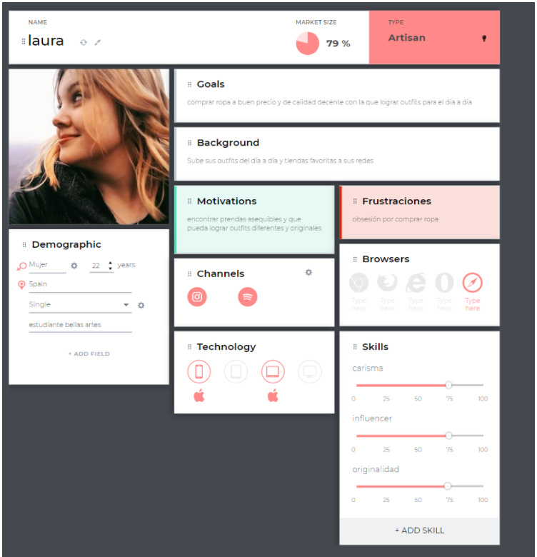
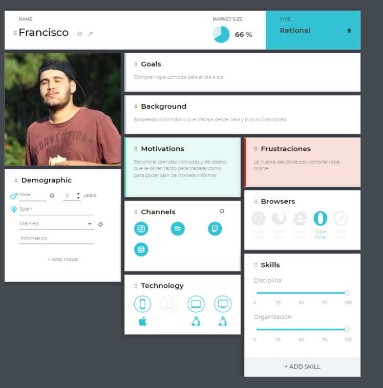

# Seminario DCU #

- Stephanie Andreína Arismendi Escobar [(alu0101351728)](alu0101351728@ull.edu.es)
- Dana Belen Choque Zárate [(alu0101328348)](alu0101328348@ull.edu.es)
- Ana Virginia Giambona Díaz [(alu0101322650)](alu0101322650@ull.edu.es)
- Noelia Ibáñez Silvestre [(alu0101225555)](alu0101225555@ull.edu.es)
  

## Índice
1. [Indica en el documento del ejemplo de aplicación del DCU, qué actividades se corresponden con el diagrama de Métodos DCU y en qué fase del diseño se ubica.](#Indica-en-el-documento-del-ejemplo-de-aplicación-del-DCU,-qué-actividades-se-corresponden-con-el-diagrama-de-Métodos-DCU-y-en-qué-fase-del-diseño-se-ubica)
2. [Aplicar el DCU para la realización de un prototipo de una aplicación web](#Aplicar-el-DCU-para-la-realización-de-un-prototipo-de-un-aplicación-web)
 
 
 

### 1. Indica en el documento del ejemplo de aplicación del DCU, qué actividades se corresponden con el diagrama de Métodos DCU y en qué fase del diseño se ubica

En el documento del ejemplo de aplicación del DCU encontramos una serie de actividades correspondientes al diagrama de Métodos DCU. Al principio se realizaron una serie de entrevistas a los clientes con el fin de identificar los primeros requisitos funcionales y no funcionales del proyecto. A continuación, se aplicó una tormenta de ideas con todos los especialistas y técnicos de la Biblioteca para identificar otros requerimientos nuevos y ver las necesidades coincidentes con los directivos. Por último, se hizo un estudio homólogo, para comparar entre los sitios con objetivos, contenidos y público similar. Todas estas tareas forman parte del método de análisis con el fin de realizar investigaciones del desarrollo de un proyecto.

Una vez finalizada la tarea de análisis, podemos ver cómo se llevan a cabo las tareas de cardsorting que consiste en la ordenación de tarjetas donde los participantes debían darle un orden consecutivo a las categorías generales y agrupar las subcategorías específicas dentro de cada grupo general. A partir de estos resultados, se lleva a cabo la realización del mapa taxonómico en el que se reorganizaron los contenidos partiendo del criterio de los propios usuarios que van a interactuar con el sitio.

A continuación, observamos cómo empiezan a desarrollar la fase de diseño donde llevan a cabo las tareas de modelado. Para ello, empiezan realizando unos primeros bocetos aproximados sobre la estructura del sitio, técnica conocida como prototipado de baja fidelidad, y continúan con el prototipado digital, fase fundamental donde se refleja la realidad del proyecto aún sin implementar.	

Finalmente, en la fase de evaluación, se procederá a poner a prueba el prototipo realizado. Esto se puede lograr mediante diferentes procedimientos, entre ellos el test de usuarios, el cual se basa en la observación de un grupo de usuarios mientras interactúan con nuestro sistema.
 
 

### 2. Aplicar el DCU para la realización de un prototipo de una aplicación web 

Se les encomendó una serie de tareas que deberán realizar intuitivamente, analizando los problemas con los que se encuentran. Este tipo de pruebas ayuda a identificar con mayor eficiencia las dificultades de uso que se puedan presentar, pues el usuario está interactuando directamente con la interfaz.

Es recomendable que para estas pruebas se aplique el protocolo de pensamiento en voz alta, que consiste en que los usuarios expresen libremente y en todo momento los pensamientos, sentimientos y opiniones sobre todos los aspectos del sistema o prototipado. 

Para la realización de nuestro prototipo, se ha decidido aplicar el DCU en una aplicación web de tienda de ropa.

En la definición de las tareas que se llevarán a cabo en la fase de investigación y diseño conceptual de la aplicación. Por un lado, en la fase de investigación se realizan entrevistas en grupo, encuestas, benchmarking  y brainstorming. Y por otro lado, en las tareas que se llevarán a cabo en la fase de diseño conceptual de la aplicación, será obtener el perfil, los personajes y los escenarios de los usuarios, con el fin de saber la posible audiencia de nuestra aplicación web.

En cuanto a los personajes y perfiles de usuarios, se crearán perfiles de usuarios que oscilan en rango de edad entre 15-40 años de clase media y, algunos influencers, que buscan ropa a buen precio y de calidad decente con lo que lograr outfit para el día día. A continuación, se muestran ejemplos de perfiles de usuarios junto a sus escenarios.

Escenario:  A Laura le gusta la moda, buscando ropa original pero amable con el planeta. Está motivada específicamente por la ayuda al planeta, pero sobre todo a su localidad. Lo máximo que puede ahorrar en un año como estudiante, es alrededor de 500 € y decide gastar 200 € en moda. Ya que sigue a un grupo de influencers los cuales tienen su propia marca de ropa, que además es su favorita, suele ver su publicidad. Los pasos que sigue Laura serían los siguientes: mientras navega por Instagram, ve una publicación del influencer al que sigue, sobre una prenda de la marca para la que trabaja, con un link que le lleva directamente a la página clicando sobre él. Clica en el enlace, y entra en la camiseta que había visto anunciada, y se da cuenta de que no le convence mucho, pero decide seguir explorando la página, clicando sobre el logotipo de la marca y accediendo a la página de inicio. Mientras navega por la página en busca de nuevas prendas de ropa, encuentra varias que le convencen, accede a cada una de ellas clicando sobre la foto de la prenda, hace una consulta sobre la medida de las tallas indicadas en la parte inferior para saber cuál es la que más se adapta a ella, selecciona su talla y las añade al carrito. Cuando procede al pago decide utilizar su tarjeta de crédito, introduce su información, pero cuando tiene que recibir el código SMS de confirmación de pago, recuerda que en su casa apenas hay cobertura y debido a ello, no recibe el código. La página shein le otorga la opción de reenviar el código o de elegir otra forma de pago, Laura se decanta por la segunda opción y escoge pagar con PayPal. Tras introducir la información y pagar, recibe un correo electrónico con el resumen y el recibo del pago, el cual está estimado en 20 días de envío. Cuando Laura recibe su pedido en la puerta de su casa se prueba la ropa y dos de las tres prendas que recibió le encantan, pero considera que hay una que no le queda bien, por lo que le gustaría realizar una devolución. Accede de nuevo a la página y busca en el menú el apartado de atención al cliente, encuentra el enlace para solicitar una devolución y decide llevar a cabo el proceso, que a su parecer puede ser algo tedioso. Se informa de que necesita acercarse a la oficina de correos después de haber rellenado un formulario de devolución con sus datos, y la razón del proceso. Ya en la oficina de correos, le dicen que tiene que pagar unas tasas de devolución adicionales ya que en la página, no se hacen cargo de ellas. Tras pagar las tasas, finaliza la gestión y vuelve a casa. Veinticuatro horas después recibe un correo de confirmación de que todo ha ido como debía, y que posteriormente recibiría otro con la confirmación de su reembolso tras comprobar que el producto se encontraba en buen estado. A la semana recibe el correo, junto con su reembolso y comprueba que todo está correcto y, así es.

Escenario: Francisco ha cobrado y decide renovar su armario buscando nueva ropa tanto para trabajar como para poder salir de manera informal a realizar las tareas del día a día fuera de casa. Para ello busca una página en la que pueda encontrar ropa barata y como resultado aparece Shein. Tras entrar en la página le aparece una pantalla de inicio con diferentes novedades en la cuál selecciona la opción de ropa de hombre que está situada en la esquina superior izquierda. De ella se despliega un menú en el borde de la pantalla con varios apartados como pueden ser ropa, accesorios, calzado. Al colocar el cursor sobre la opción de ropa aparece otro pequeño menú similar con los distintos tipos de ropa y clica en camisetas. A continuación, elige una camiseta de entre los resultados que le gusta, le aparece una pantalla donde sale la camiseta con los detalles de esta y selecciona la talla y pulsa añadir a mi cesta. Esto hace que salte una notificación enseñando el contenido de la cesta y le da a tramitar el pedido. Introduce los datos correspondientes (nombre, nº de tarjeta, dirección y correo electrónico) y confirma la compra. Tras esto, se muestra un mensaje de “Gracias por la compra” y se le envía una confirmación al correo. 

